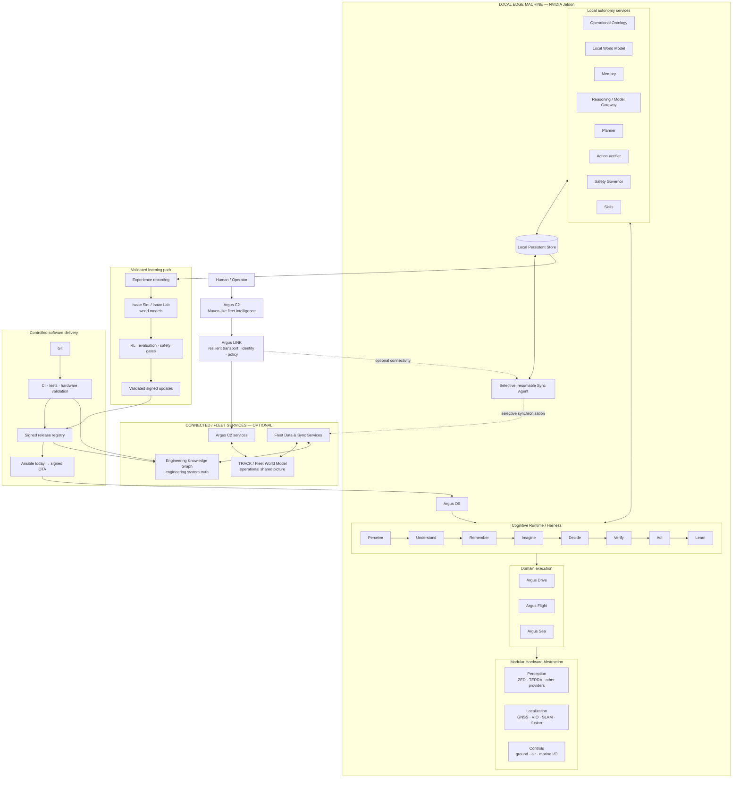

# Argus Target Architecture — Claude Code Handoff

Status: **TARGET architecture**  
Truth discipline: running code, tests and hardware evidence describe **AS-BUILT** reality. This document describes the agreed **TARGET** direction. Do not claim a target component is implemented without repository or hardware evidence.

## Architecture diagram

## Non-negotiable architecture rules

1. **Edge-first autonomy:** the machine must retain local perception, state, memory, planning, verification, safety and action. Loss of connectivity must not remove safe local autonomy.
2. **Connectivity is optional:** Argus LINK enables command, coordination, synchronization and fleet learning, but is not an execution-time cloud dependency.
3. **One Argus OS:** Land, Air and Sea share the cognitive runtime and stable platform contracts. Argus Drive, Flight and Sea are domain execution layers beneath that common runtime.
4. **Stable hardware contracts:** ZED, TERRA and other providers are modular implementations behind perception, localization and control abstractions. Do not make a vendor SDK the system architecture.
5. **Operational and engineering graphs remain separate:**
   - Operational Ontology / Local and Fleet World Models represent the mission world.
   - Engineering Knowledge Graph represents repositories, components, interfaces, tests, dependencies, status, bugs, decisions, risks, validation and releases.
6. **Verification and safety are explicit:** Action Verifier and Safety Governor are first-class runtime boundaries, not implicit behavior hidden inside the planner or model.
7. **Persistence precedes synchronization:** local state, memory, mission history, evidence and audit data persist on the machine. Sync is selective, resumable and policy-governed.
8. **Learning is gated:** experience may feed simulation, world models and RL, but nothing goes directly from learning into fleet execution. Updates require evaluation, safety gates, signing and controlled rollout.
9. **Delivery is traceable:** Git → CI/tests/hardware validation → signed release registry → Ansible/OTA → fleet. Releases and validation evidence link into the Engineering Knowledge Graph.
10. **Model-agnostic reasoning:** the Reasoning / Model Gateway must allow controlled replacement and routing of models without coupling the autonomy architecture to one model vendor.

## Instructions for Claude Code

1. Audit the repository and map the **AS-BUILT** system to this **TARGET** architecture.
2. Label every target component as `implemented`, `partial`, `simulated`, `planned`, `missing`, `deprecated` or `unknown` and cite the supporting file, test, deployment or hardware evidence.
3. Identify couplings that violate the boundaries above, especially cloud-required autonomy, vendor-specific perception leaking into core logic, missing safety/verification boundaries, and undocumented shared state.
4. Propose the smallest migration sequence that improves the architecture without breaking working behavior.
5. Update relevant Markdown architecture/status files when code evidence contradicts existing documentation. Preserve a clear change record instead of silently rewriting history.
6. You may change or replace existing documentation when necessary for consistency. Do not overwrite working code merely to make it resemble the diagram; first document the mismatch and migration rationale.
7. Keep open questions explicit when repository or hardware evidence is insufficient.

Use the accompanying `argus-target-architecture.html` as the presentation-quality visual reference. Treat this Markdown file as the machine-readable architecture contract.
